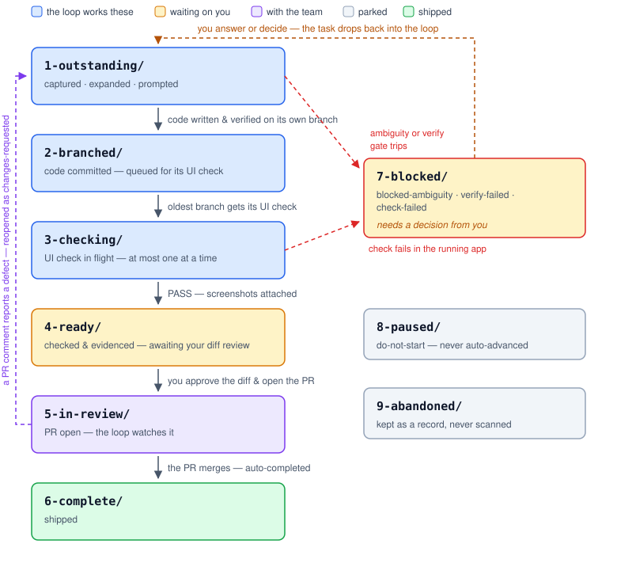
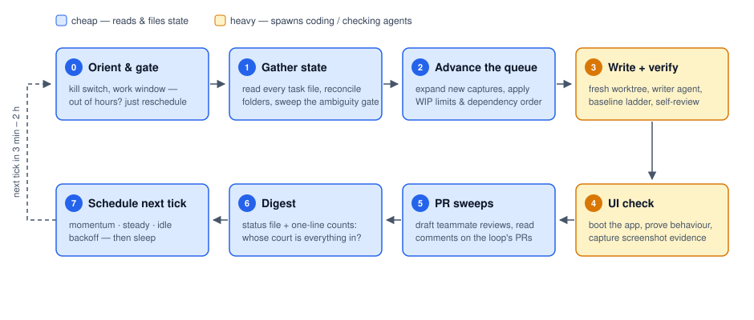
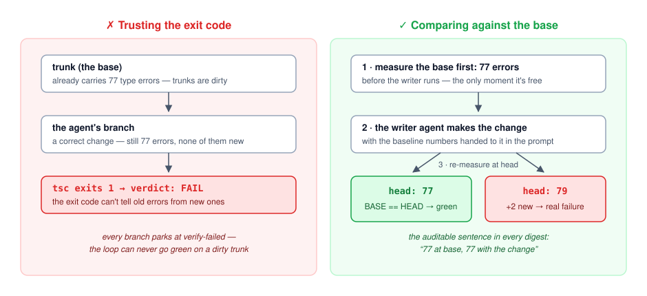
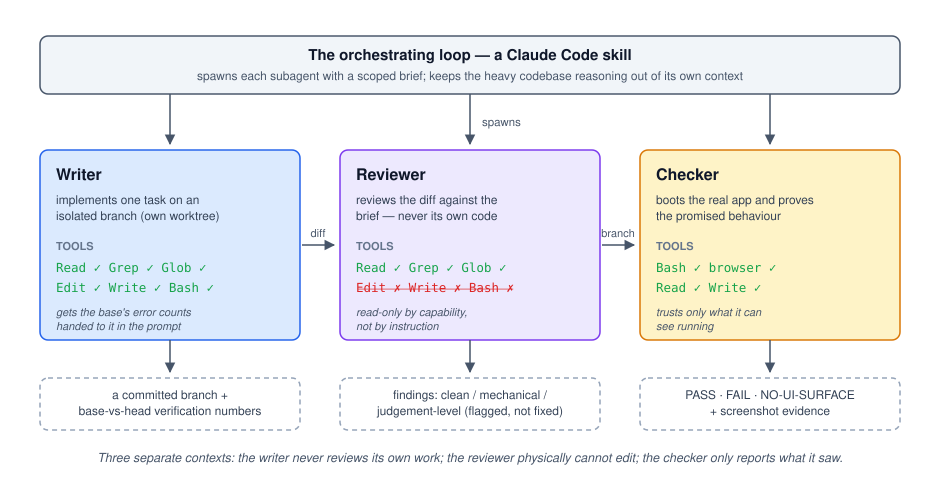
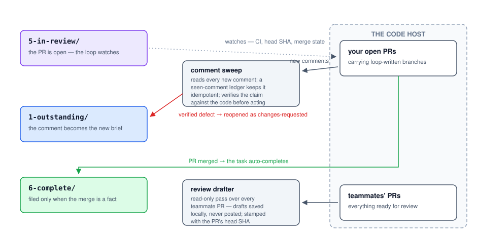

Most teams use LLM coding assistants the same way: open a chat, describe a task, watch the tokens stream, read the diff, repeat. It works, but it has a ceiling — the human is the event loop. Every task costs a full round of your attention, whether it needed your judgement or not.

This article walks through a different architecture: an **autonomous task loop** built on Claude Code that inverts the relationship. The agent runs a self-paced cycle in the background, advancing a backlog of tasks through expand → implement → verify → check stages, and files each task into a folder that tells you — at a glance — whether it's the machine's problem or yours. You stop being the event loop and become what you should have been all along: the reviewer of finished, evidenced work, and the decision-maker for the questions that actually need a human.

The implementation here uses Claude Code specifics — skills (markdown instruction files the agent loads for a given job), subagents (fresh agent instances spawned with a scoped brief and a restricted toolset), and a scheduling primitive that lets a session re-invoke itself. But the architecture is portable to any agent harness that can read files, spawn scoped workers, and wake itself up.

## The core contract: the tick

Everything hangs off one design decision, so it's worth stating as a contract:

> **Every cycle of the loop — a "tick" — is idempotent and resumable. All state lives in the task files themselves, never in the agent's memory. A tick reads state fresh, advances whatever it safely can, writes state back, emits a digest, and schedules the next tick. Killing and restarting the loop loses nothing.**

This sounds like a distributed-systems platitude, but it's the property that makes everything else survivable. LLM sessions crash, get interrupted, run out of context, and hallucinate their own history. If the loop's state lived in the conversation, any of those would corrupt the pipeline. Because state lives in plain markdown files on disk, the conversation is disposable: the next tick reconstructs reality by reading the files, exactly the way a crashed worker rejoins a queue.

It also means the human can intervene at any moment — edit a file, drag it to a different folder, answer a question inline — and the loop simply picks up the new reality on its next pass. There is no "please don't touch the state while the agent is running." The files *are* the API between human and machine.

## Task files as the database, folders as the state machine

Each task is one markdown file with YAML frontmatter:

```markdown
---
title: Paginated list drops rows after a refresh
status: outstanding
loop_stage: prompted
loop_branch: feature/paginated-list-refresh
loop_base_sha: 3f9c2ae
depends_on: []
---

## What
After a manual refresh, the list view shows only the first page...

## Approach
The refresh handler rebuilds state from the loaded page only...

## Files
- src/features/list/useListState.ts
- src/features/list/RefreshButton.tsx

## Ambiguity
1. 🚩 Should refresh preserve the user's scroll position, or reset it?

## Apply Prompt
(a self-contained implementation brief, generated by the expand step)
```

The frontmatter is the machine-readable state: the pipeline stage, the branch the code lives on, the commit it was based on, which comments on its PR have already been processed. The body is the human-readable brief: what the task is, how to approach it, which files it touches, and — critically — an **Ambiguity** section listing every open question.

Then comes the trick that makes the whole system legible: **the folder a file sits in *is* its state.**

```
todos/
├── 1-outstanding/    ← the loop's court: live work
├── 2-branched/       ← the loop's court: code written, queued for its UI check
├── 3-checking/       ← the loop's court: UI check in flight (at most one)
├── 4-ready/          ← YOUR court: checked, evidenced, awaiting your diff review
├── 5-in-review/      ← the team's court: PR open, the loop watches it
├── 6-complete/       ← shipped
├── 7-blocked/        ← YOUR court: needs a decision
├── 8-paused/         ← parked by you, never auto-advanced
└── 9-abandoned/      ← dropped, kept as a record, never scanned
```



The numeric prefixes make any file explorer — or any plain-markdown note app pointed at the same directory — list the pipeline in order. `ls todos/4-ready/` answers "what's waiting on me?" without querying anything. And because moving a file *is* a state change, drag-and-drop in a note app becomes the human's control surface: drag a blocked task back into `1-outstanding/` and the loop treats that as an instruction.

Two rules keep this honest:

- **Folder, `status`, and `loop_stage` must always agree**, and whoever changes one changes all three in the same operation. Frontmatter that disagrees with its folder is the fastest way to make every view of the pipeline lie.
- **When they *do* disagree — because a human dragged a file — the folder wins.** The human moved it deliberately; the loop rewrites the frontmatter to match, never the reverse.

Each folder also has an owner. That's the point of the split: at any moment, everything in folders 1–3 is the loop's problem, everything in 4 and 7 is yours, and 5 is with your team. The loop's digest reduces to a single line of counts — `[1-out 3 · 2-br 1 · 4-ready 2 · 7-blocked 1]` — and that line tells you exactly how much of the pipeline is in whose court.

## Anatomy of a tick

A tick is a fixed sequence of steps. The order matters: cheap, safe housekeeping first; the expensive, risky work in the middle, behind gates; communication last.



**Step 0 — Orient and gate.** Check the kill switch (a sentinel file whose presence stops the loop cold — the human can pause everything by creating one file, from any tool). Check the work window: the loop only runs weekday business hours, and an out-of-hours tick does nothing but reschedule itself. No state reads, no agent spend.

**Step 1 — Gather state.** List every live folder, read every task's frontmatter, reconcile any folder/frontmatter disagreements (folder wins), infer missing stages, topologically sort declared dependencies, and sweep the ambiguity gate across everything (more on that below). This step never spawns subagents — it's pure reading and filing.

**Step 2 — Advance the queue.** Decide what this tick will actually do, after applying the flow-control gates: a WIP limit (if more than two tasks are already waiting on the human's review, or more than ten on their decisions, stop producing more), a check valve (if the queue of unverified branches is three deep, spend this tick checking instead of writing), and the dependency gate (a task whose prerequisite isn't ready waits, without bothering anyone).

**Step 3 — Write and verify.** The risky step. For at most two tasks per tick, sequentially: create an isolated git worktree, measure the verification baseline, spawn a writer subagent with the task's implementation brief, run the verification ladder, run a self-review by a *different* agent, and commit. Sections below unpack each of those.

**Step 4 — The UI check.** For the oldest task in the branched queue: spawn a checker subagent that boots the actual application from the task's worktree and proves the promised behaviour in a running app, with screenshots.

**Step 5 — PR sweeps.** Two of them, in both directions: draft reviews of teammates' open PRs (saved locally, never posted), and read new comments on the loop's own PRs — its feedback inbox.

**Step 6 — Digest and reschedule.** Write a status file, print a one-glance digest, and schedule the next tick.

**Step 7 — Improve the loop.** Extract anything this tick learned the hard way and propose an edit to the loop's own instruction file. More on why that matters at the end.

## The three hard gates

The safety story compresses to one sentence: **never code the wrong thing, never hand over broken code, never claim a feature works without showing it.** Each clause is a gate.

### Gate 1: the ambiguity gate — never code the wrong thing

Every task file carries an `## Ambiguity` section. If any item in it is open — flagged, unresolved, awaiting sign-off — the task moves to `7-blocked/` and is **never auto-coded**. The rule of thumb: a wrongly blocked task costs the human thirty seconds; a wrongly coded one costs an afternoon. When in doubt, block.

Three refinements make this gate actually work in practice:

- **Sweep it every tick, against every live task** — not once when the task is created. Ambiguity lists grow after the fact: a task that was clean on Monday can acquire an open question on Thursday without its stage ever changing.
- **Read the content, not the section's existence.** Resolved items stay in place, annotated as resolved. A gate that blocks on "the section has text" re-blocks every task that ever had a question.
- **The list is an output, not just an input.** After the loop expands a task against the real codebase, it re-runs the gate on what it found. Two shapes recur: *the premise is false* (the "missing" feature already exists), and *the fix crosses a boundary the current branch structure doesn't allow*. Both are questions for a human, and both are invisible until an agent has actually read the code.

There's an inverse rule too: don't inflate a recommendation into a blocker. The test is whether coding now risks doing the *wrong work* — not whether a human might have an opinion.

### Gate 2: the verify gate — never hand over broken code

Covered in its own section below, because the naive version of this gate is worse than useless.

### Gate 3: the UI check — never claim a feature works without showing it

Also below. It exists because of a class of bug that no diff review can catch.

## Verification that survives a dirty trunk

Here is the trap almost every "agent runs the tests" setup falls into: **on a real production codebase, the type check, the linter, and the test suite are frequently non-green on a pristine trunk.** If the loop reads exit codes as pass/fail, every branch it writes parks at `verify-failed` forever — through no fault of its own.



The fix is baseline comparison:

```bash
# BEFORE spawning the writer agent — the only moment this is free:
base_errors=$(typecheck | strip_ansi | grep -c "error")   # e.g. 77
base_tests="412 passed, 5 failed"                          # tally, not exit code

# ... writer agent implements the task ...

head_errors=$(typecheck | strip_ansi | grep -c "error")    # e.g. 77
# BASE == HEAD            → green
# HEAD > BASE, or an error in a file this branch touched   → real failure
```

Details that turn out to be load-bearing:

- **Measure the baseline before the writer runs, and hand it to the writer in its prompt.** Afterwards, a true base measurement costs a stash round-trip. And a writer told "the suite passes on trunk" when five tests were already failing will either chase an unfixable failure or give up on a good branch.
- **Compare test *tallies*, not exit codes** — the pass/fail counts, matched against the same counts at base.
- **Strip ANSI colour codes before grepping.** Pretty-printing type checkers put escape sequences between the word `error` and the code; a naive grep silently returns zero, which reads as a clean pass. The most dangerous failures in this system are the ones that look like green.
- **Never run a bare `test` script** in a monorepo — in some packages it's watch mode, which never exits, and the whole tick hangs with it.

The digest then reports the verdict in an auditable sentence: *"77 at base, 77 with the change."* Anyone reading it can see not just the verdict but the evidence for it.

## Separation of duties, enforced by tools — not prompts

A single agent that writes code, reviews its own diff, and declares it working is marking its own homework. Prompting it to "be critical" doesn't fix that; the incentives live in the architecture, so the fix has to as well.

The loop uses three distinct subagents, and the separation is structural:



**The writer** gets full tools and one job: implement one task, on one branch, in an isolated worktree, with the verification baseline handed to it up front.

**The reviewer** is a separate agent definition whose tool list is `Read`, `Grep`, `Glob` — and nothing else:

```markdown
---
name: reviewer
description: Structurally read-only reviewer. No Edit, Write, or Bash —
  it cannot alter the codebase even if instructed to.
tools: Read, Grep, Glob
---
You review a diff against the brief that produced it.
Check brief-compliance first: does the diff do what was asked?
Note any deviation, even a justified one — deviations get flagged,
not silently accepted...
```

The reviewer *cannot* edit the code, run commands, or "just fix it while I'm here" — not because it was asked nicely, but because the capability doesn't exist in its toolset. It's also never the same agent instance that wrote the code, so it has no memory of the reasoning that produced the diff and no stake in defending it. Its findings route three ways: clean → commit; minor mechanical issues → one repair round (from a capped budget of two) and a re-review; judgement-level concerns → commit anyway, but flag the task in the digest as ready-with-reservations, never as an unqualified pass. The human's diff review is the final gate regardless — the flag just makes sure they arrive knowing what the machine wasn't sure about.

One reviewer rule earns special mention because it encodes a real failure mode of coding agents: **a claimed "no behaviour change" on code the brief fenced off is a blocker until proven line by line — and a code comment asserting the change is safe is itself a finding.** Agents reach for nearby "obvious" optimisations while implementing something else, describe them as neutral because they look symmetric, and the reassuring comment they leave behind suppresses scrutiny at every later review.

**The checker** is a third agent — never the writer, never the reviewer. Its existence is justified by one class of bug: the writer once built a client-side guard that was correct for every record on the *loaded page* of a server-paginated list, and silently wrong for everything on page two. Two diff reviews passed it — every guard in the diff was present and correct; only the data feeding them was incomplete. The bug was **invisible in the diff and reachable only by running the app.** So the checker boots the application from the task's worktree, writes a throwaway browser-automation spec, exercises the promised behaviour, and returns a verdict with evidence.

## Evidence, not assertions

The checker's contract is worth spelling out, because "the agent says it works" is exactly the claim this system refuses to accept.

- **Screenshots are the deliverable.** Two to four images per check, each proving one claim you can state in a sentence: *the behaviour the brief promises, visibly happening.*
- **Assert behaviour, not page-loads.** A page that renders but doesn't do the promised thing is a FAIL.
- **The orchestrator audits the evidence before believing the verdict** — including hashing the screenshots. Three filenames sharing one checksum is one proof masquerading as three.
- **Exercise the feature past the first page of data.** Lists, grids, and leaderboards are usually server-paginated, and the default view is exactly where that pagination bug hides.
- **Honest verdicts only.** A backend-only change gets "no UI surface — verified by tests only," recorded as exactly that: an honest pass-through, never a fake green tick. An environment that wouldn't boot is a FAIL with the reason class `environment`, never quietly softened into a pass-with-caveats. Anything the check *couldn't* prove is stated plainly, because silence reads as coverage.

There's a subtler provenance problem once the system runs for real: the evidence directory ends up shared. The loop writes screenshots into it, and the human drops files in — a production screenshot of the original bug, a chat capture, a design reference. The loop must never present the human's screenshot *of the problem* as its own screenshot *of the fix*. The mechanics: the loop owns a reserved filename prefix and treats everything else as input; file modification times and ownership are cheap cross-checks; and the default is asymmetric — when provenance is unclear, treat the file as the human's. Reading an output as input costs nothing; the reverse fabricates evidence.

## Closing the loop with the team

A task isn't done when the code is written; it's done when it ships. So the pipeline extends past the human's diff review into the team's normal PR flow — and this is where most automation quietly goes blind.



Every tick runs **two sweeps**, and they are not the same job:

**Sweep one: teammates' PRs** — *"what should I review?"* The loop drafts a review of every open PR from anyone else and saves it locally for the human. It never posts. Staleness is handled deterministically, not by timestamp guesswork: each draft is stamped with the PR's head commit SHA. Same SHA → skip; different → re-review.

**Sweep two: the loop's own PRs** — *"what did someone say about work already shipped?"* This is the feedback inbox, and it's the sweep that's easy to forget entirely. This system's first version excluded the operator's own PRs from the sweep — which meant a teammate's regression report on a loop-written branch was never seen at all. The task had already been filed complete, the digest cheerfully reported the queue cleared, and the comment sat unread. Hence the rule the fix produced: **a merged task file is not the end of the story — an open PR with an unread comment is still the loop's responsibility**, and the sweep covers completed tasks too.

When a comment arrives, triage is deliberate:

- A thumbs-up costs nothing.
- A comment asserting a **defect** gets *verified against the code before the loop acts on it*. Teammates can be wrong, partly right, or right about a bug that has since moved. If the claim holds, the loop writes the substance of the comment (not a link — the task file must stand alone) into the task's feedback section, sets the stage to `changes-requested`, and moves the file back into `1-outstanding/`. The comment becomes the brief for the rework round, which reuses the existing branch and worktree, then re-runs the full verification ladder, self-review, and a fresh UI check.
- A style opinion or judgement call is surfaced in the digest for the human — the loop does not self-authorise rework from taste.

Every processed comment's ID lands in a `seen_comments` ledger in the task's frontmatter. That ledger is what keeps the sweep idempotent — without it, every tick would reopen the same task from the same comment, forever.

And the pipeline's only automatic entry into `6-complete/` happens here: when the PR merges. Not when the code looks done, not when the checks pass — when the merge is a **fact the loop can verify** against the host's API. (Against the API, note — not via `git merge-base --is-ancestor`. Squash-merging replaces the branch's commits with a new one, so the ancestor check reports "not merged" for eternity and the loop would conclude its work was lost.)

## Self-pacing and what it costs

The loop schedules its own next tick, and the cadence is adaptive:

- **Momentum (~3 minutes):** the last tick advanced something, or the human gave input. Stay hot.
- **Steady (~15 minutes):** work exists but nothing moved this tick.
- **Idle backoff (30 → 60 → 120 minutes):** consecutive quiet ticks stretch the interval; any real work or human input snaps it back to momentum.
- **Blocked on the human (~2-hour heartbeat):** everything actionable is in the human's court; there's nothing to be eager about.

The cost model follows the tick structure: a quiet tick only reads files — cheap. The real token spend is spawning writer and checker subagents, which only happens when the gates say there's genuine, safe work to do. In practice the expensive steps are also the throttled ones (two writes per tick, one check per tick), so cost scales with useful output rather than with wall-clock time.

Worktree isolation deserves a final word here, because it's the guardrail that protects the *human's* machine. Every code-writing task gets its own `git worktree` — a separate directory with its own HEAD and index, sharing the object store. The incident that made this rule: with a shared checkout, the human switched branches mid-write, and sixteen hundred agent-written lines landed uncommitted on top of *their* work in progress. A shared checkout means the loop and the human fight over one HEAD; a worktree makes the collision structurally impossible rather than procedurally avoided. The pattern by now should look familiar — this system prefers making failure impossible over asking anyone, human or agent, to be careful.

## What you actually get

After running a system like this for a while, the benefits sort themselves into a few clear buckets:

**Your attention gets spent at the right altitude.** The loop consumes the parts of the SDLC that are mechanical — expanding a one-line task against the codebase, writing the first correct draft, running the verification ceremony, checking the running app — and what reaches you is a reviewed diff with evidence attached, or a crisp question with options. Reviewing and deciding were always the highest-value human contributions; now they're most of the job.

**Every claim is auditable.** "77 at base, 77 with the change." Screenshots per behaviour. Verdicts that distinguish "proved" from "couldn't prove." When you approve a loop-written branch, you know exactly what was and wasn't demonstrated.

**The state is legible to everything.** Humans read folders in a note app or a file explorer; scripts and dashboards parse the same frontmatter; the loop reconstructs the full pipeline from disk on every tick. One representation, no sync jobs, no second database to drift.

**Interruptions batch.** Blocked questions accumulate into a folder you clear at your convenience, instead of arriving as real-time "quick question…" pings that fragment your day.

**Crash recovery is free.** Kill the loop mid-tick, reboot the machine, come back Monday — the files are the state, and the next tick picks up where reality left off.

## Pain points, honestly

None of the rules above were designed on a whiteboard. Nearly every one is a scar with documentation, and it would be dishonest to present the system without the failures that shaped it:

- **Redundant state drifts.** Folder, `status`, and `loop_stage` encode one fact three ways, and an early audit found twenty-three files where they disagreed — tasks filed complete whose frontmatter still said otherwise. The fix was procedural (update all three in one operation, and whoever touches a file fixes any mismatch on sight), but the lesson is general: every denormalisation you add for legibility is a consistency invariant you now have to enforce.
- **Green that lies is worse than red.** ANSI codes making a grep count zero errors; a screenshot of the wrong claim; a test added during a repair round that pins the *broken* behaviour as correct and gets the same bug re-approved at the next review. A red herring costs a re-run; a false green costs your trust in the whole pipeline. The counter is paranoia at the audit layer: strip formatting before counting, hash the evidence, and treat "the test the fix added" as part of the diff under review.
- **Feedback channels fail silent.** The unread-comment incident above is the canonical case: the system wasn't wrong about anything it looked at — it just wasn't looking. Blindness doesn't error; you have to enumerate the directions information arrives from and prove each one is swept.
- **Agents drift out of scope.** The nearby-refactor problem is persistent: models reach for improvements adjacent to the task, and describe them as safe. Structural containment (read-only reviewers, worktrees, repair budgets) holds it better than instructions do.
- **The environment is half the work.** A fresh worktree shares git objects but not installed dependencies or generated files; verification before bootstrap measures noise. Watch-mode scripts hang ticks. Headless browsers screenshot only on failure unless told otherwise. Expect to spend real effort making "run the app from a clean worktree" boring — it's the foundation the honest UI check stands on.

The meta-pattern is the most transferable thing in this article: **every rule in the loop's instruction file is written as the rule *plus the incident that produced it.*** Bare rules get "simplified" away by a later well-meaning edit; a rule with its scar attached defends itself. And the tick's final step — propose improvements to the loop's own instructions — is what turns each incident into a permanent upgrade instead of a war story.

## When *not* to build this

- **Exploratory or greenfield work.** The loop's value is safe autonomous execution against a defined brief. When the task is "figure out what we should even build," the ambiguity gate would (correctly) block everything, and you should be in an interactive session instead.
- **Work where taste is the deliverable.** Visual polish, API ergonomics, copywriting — tasks where every intermediate step needs a human eye gain nothing from batching.
- **Teams without a review culture.** The loop's output is *reviewed* work — it assumes a human diff review and a PR process to feed. Bolted onto a push-to-main workflow, it just automates the production of unreviewed risk.

## Wrap-up

The load-bearing ideas, in one list: state in plain files, folders as a state machine the human can drive with a drag; an idempotent tick that rebuilds reality from disk; hard gates in front of every irreversible or expensive step; verification by baseline comparison instead of exit codes; separation of writer, reviewer, and checker enforced by capability rather than prompt; evidence with provenance instead of assertions; feedback sweeps in both directions with an idempotency ledger; and a loop that amends its own manual every time reality wins an argument.

None of that is specific to one vendor's harness. Claude Code makes it convenient — skills for the orchestration logic, subagents with per-agent tool grants for the separation of duties, self-scheduling for the pacing — but the architecture is just good systems engineering applied to a new kind of unreliable-but-capable worker. Treat the LLM as a talented colleague with no memory and no accountability, design the process so that neither deficit can hurt you, and it will quietly clear your backlog while you do the work only you can do.
