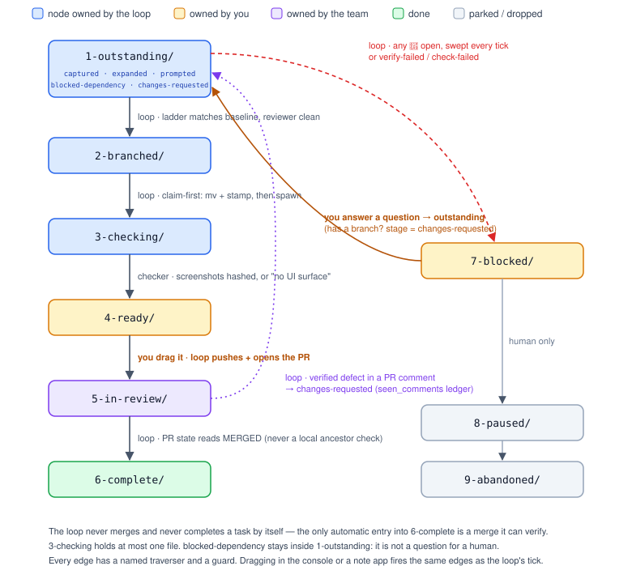

At 08:25 one morning this week a task was flagged top priority. By 09:41 it was sitting in a folder called `4-ready/` with a branch, a passing verification ladder, a second-agent review and eight screenshots of the feature working in the running app. A pull request went up at 10:07, merged at 10:22, and the task filed itself as complete and deleted its own worktree. The human involvement was: write four sentences, drag one file, click merge. That is not a demo. It is the 156th task through the same pipeline since April, on a production monorepo with a team of people pushing to it all day.

The previous article on this site covered the loop itself — the tick, the gates, the writer/reviewer/checker split. This one is about the thing that made it *usable*: modelling the whole workflow as an explicit graph and then building a web console that is nothing more than a view onto that graph. I've started calling the discipline **graph engineering**, because the useful design work turned out to be deciding what the nodes and edges are, who is allowed to traverse each edge, and what guards it — and almost none of it was about prompting.

## The contract

> **The workflow is a graph. Every task is a token sitting on exactly one node. Every node has an owner. Every edge has a guard and a named traverser. The graph lives in plain files on disk, and every tool — the agent loop, the web console, a note app, a shell — reads and writes the same files. No tool holds state the others cannot see.**

Everything in this article is a consequence of that paragraph. The interesting bit is that there are actually three graphs layered on top of each other, and confusing them is where the early versions went wrong.

## Graph one: the state graph

The first graph is the state machine. Each node is a folder; the folder a task file sits in *is* its state. Numeric prefixes make any file explorer list the pipeline in order.

```
todos/
├── 1-outstanding/   loop's court
├── 2-branched/      loop's court  (code written, queued for UI check)
├── 3-checking/      loop's court  (at most one file — checks serialise)
├── 4-ready/         YOUR court    (checked, evidenced, awaiting diff review)
├── 5-in-review/     team's court  (PR open; the loop watches it)
├── 6-complete/      done
├── 7-blocked/       YOUR court    (needs a decision)
├── 8-paused/        parked by you; never auto-advanced
└── 9-abandoned/     dropped; kept as a record, never scanned
```



What makes this a graph rather than a list is the edge table. Every transition has a **traverser** (who is allowed to fire it) and a **guard** (what must be true). A few of the load-bearing ones:

| Edge | Traverser | Guard |
|---|---|---|
| `1-outstanding` → `2-branched` | the loop | worktree exists, verification ladder matches baseline, read-only reviewer had no blocking findings |
| `2-branched` → `3-checking` | the loop | claim-first: move the file and stamp `loop_check_started` *before* spawning the checker |
| `3-checking` → `4-ready` | the background checker | screenshots on disk, hashed, no duplicates, or an honest "no UI surface" |
| `4-ready` → `5-in-review` | **the human drags the file** | the drag *is* the authorisation: the loop pushes the branch and opens the PR |
| `5-in-review` → `6-complete` | the loop | the PR's own state reads `MERGED` (never a local ancestor check — the repo squash-merges) |
| any outstanding stage → `7-blocked` | the loop | at least one open question exists |
| `7-blocked` → `1-outstanding` | **the human answers a question** | every open item has an answer |
| anything → `8-paused` / `9-abandoned` | human only | — |

Two rules fall straight out of drawing the edges with owners on them.

**The loop never merges and never completes a task on its own.** The only automatic entry into `6-complete/` is the merge, because a merge is a fact the loop can verify against the host's API. Making the human file a merged task by hand is pointless friction; letting the loop *decide* something is done is a power it should not have.

**Folder wins over frontmatter.** Each task file also carries `status:` and `loop_stage:` in YAML, which is redundant state for the sake of legibility. Redundant state drifts. One sweep found twenty-three files where the three disagreed. So the rule is that whoever touches a file fixes all three in one operation — and where they still disagree, the folder is authoritative, because the human moved it deliberately.

Within a node there is also sub-state. `1-outstanding/` is one folder, but `loop_stage` inside it can be `captured`, `expanded`, `prompted`, `blocked-dependency` or `changes-requested`, and the difference between "not started" and "coded on the next tick" matters to the person looking at the board. The console renders those as badges on the card. The folder is the coarse node the human can drag; the stage is the fine node the loop advances.

## Graph two: the dependency DAG

The second graph is between tasks. A task can declare `depends_on: [other-task]`, and that one field drives three separate behaviours:


**Ordering.** Every tick topologically sorts the live tasks. On a cycle it blocks both ends and never guesses.

**Base resolution.** A dependent task's branch is cut from the branch of the task it depends on, not from `main`, so the work stacks. The base is resolved to a *SHA*, recorded in the task file as `loop_base_sha`, because a branch name can move between resolution and use — and because it is the only way to tell later whether the base moved under the branch.

**Gating the expensive step only.** `depends_on` gates SEND (the code-writing step), not expansion. A dependent task is still fully explored against the codebase and turned into an implementation brief while it waits, so when its prerequisite lands it is coded on the next tick rather than starting from a one-liner.

The subtle design decision is where a dependency-blocked task *lives*. It is not a question for the human, so it never lands in `7-blocked/`. It stays in `1-outstanding/` with `loop_stage: blocked-dependency`. That sounds like pedantry until you remember that `7-blocked/` is the folder the human clears from their phone between meetings. A folder that mixes "needs your decision" with "waiting on another task" trains the human to skim it, and a skimmed blocked folder is where questions go to die.

## Graph three: questions as gates

The third graph is the one I'd never seen anyone draw before this system, and it is the one that changed the experience of using it. Each task's `## Ambiguity` section is a list of items, and each item is a tiny node with its own state:

- `🚩` open — needs a human
- `📌` note — recorded, does not block
- `✅` resolved

An item with **no marker counts as open**. Every ambiguity section written before markers existed would otherwise silently unblock, and a question nobody answered is still a question.

The gate is simple: if any item on a task is open, the task sits in `7-blocked/` and is never auto-coded. The gate is swept **every tick, against every live task** — not once at capture — because questions arrive after the fact. An agent expanding a task against the real codebase routinely discovers that the premise is false (the "missing" feature already exists) or the fix crosses a boundary the brief didn't anticipate. Both are new open items on a task that was clean yesterday.

The rule of thumb that governs the whole gate: a wrongly blocked task costs the human thirty seconds; a wrongly coded one costs an afternoon. When in doubt, block. The counterweight is real too — don't inflate a recommendation into a blocker. The test is whether coding now risks doing the *wrong work*, not whether a human might have an opinion.

### The grammar is parsed, not decorative

Here is the point where the question graph stops being a documentation convention and becomes engineering. The items have a strict shape, because a machine reads them:

```markdown
3. 🚩 **OPEN — Should a refresh keep the user's scroll position, or reset it?**
   Context: the list view rebuilds its state after a manual refresh.
   Right now: it jumps to the top, because state is rebuilt from page one.
   **Options:** (a) keep position — recommended, matches every other list ·
   (b) reset to top, simpler but jarring · (c) keep position only if the
   same page is still loaded.
   *Detail:* `useListState.ts` rebuilds from `pages[0]`; `RefreshButton.tsx`
   calls it without the current offset.
```

Every line of that template is there because of an incident:

- **The question line is ≈25 words and contains no jargon** because the human answers these on a phone between meetings. A question that has to be parsed twice sits unanswered, and an unanswered question blocks the task every tick.
- **`Context:` exists because the console shows one card at a time.** The item has to stand alone with no `## What` above it and no memory of the meeting where it came up.
- **`Right now:` is never "not applicable".** It's either the nearest existing behaviour, or what the code will do if nobody decides. The test: does the line change what you'd pick?
- **Options are parsed into buttons.** `(a) `, `(b) `, `(c) ` separated by ` · `. The button label is the text before the first dash or comma, so the *decision* goes first and the consequence after — lead with the consequence and the button reads as gibberish. Exactly one option carries "recommended" and gets a star. A single `(a)` renders as plain text, because if there is only one option it isn't a question.
- **Numbering appends, never renumbers**, because earlier answers reference the old numbers.

The incident that proved the grammar is load-bearing: a sub-item convention (`1b.`) was invented in a task file before the parser knew about it. The parser matched `\d+\.` only, swallowed `1b.` as continuation text under a resolved `1.`, counted zero open items, and the task sailed through the ambiguity gate with a live question open. Worse, answering "2" in the console wrote the answer under `2b` and flipped `2`'s flag. Inventing a grammar silently disables the gate.

## The console: a projection of the graph, not a second system

With three graphs defined and living in files, the web console has a very small job: render them, and let the human traverse the edges they own. That smallness is the whole point. There is no database behind the console. Its server parses the same markdown the loop parses, and its writes go to the same files, under a per-file lock, atomically.


The board is a drag-and-drop kanban across the nine folders, with each column coloured by owner — loop, you, team, done. Dragging a card between columns *is* a `git mv`. The drawer on a card has tabs for overview, ambiguity (with a count), the apply prompt, evidence (with a count), the diff rendered from `git diff <base-sha>...HEAD` inside the task's worktree, and a chat.

And the questions tab is where the UX change actually happens. Each open item is a card. If the item's options parsed, they are buttons; the recommended one is starred. There is a free-text box for a ruling the options didn't anticipate. Two buttons at the bottom, on purpose: **save answers** records rulings without moving the task (useful when only some questions are settled), and **⚡ answer & unblock** also moves the file back to `1-outstanding/`, where the loop picks it up on its next tick.

That is the whole interaction model for the human's part of the pipeline: a folder of cards, each with buttons. It works on a phone. The loop's output arrives as a reviewed diff with screenshots attached, or as a crisp question with options. Reviewing and deciding were always the highest-value things an engineer does; the console makes them most of the job.

### Guards are shared, not duplicated

The transition table lives in one module imported by both the server and the browser. The server enforces it; the client uses the same table to colour drop targets live while you drag. Drop a card on `4-ready/` when the task has no `loop_branch` and the target refuses — *"ready means checked code exists"*. Drop it on `2-branched/` and it warns that this is normally the loop's call. Drop it on `6-complete/` with an open PR recorded and it tells you the task belongs in `5-in-review/`. The rules the loop's instruction file states in prose are the rules the UI shows you in colour, from the same source.

The same discipline applies to the ambiguity grammar. The loop's state tool deliberately has *no parser of its own* — it reads task files through the console's parser, so there is exactly one implementation of the grammar and it cannot drift from what the human sees. When a task looks wrong, you check the tool against the written spec and fix the tool.

## Many writers, one file

The property that makes this genuinely different from a dashboard bolted onto a queue is also the one that produces the hardest bugs: **the task files have many concurrent writers.**


The loop writes on every tick. The console writes when you drag or answer. A per-task chat agent — the `claude` CLI in print mode, with no shell and no file-creation tools, so it cannot move tasks or touch git — can edit its own task file to record a conversational answer. A note app pointed at the folder lets you drag files between states. And you can just open the file in an editor. All of that was a deliberate choice: the files are the API, and no tool gets to say "don't touch the state while I'm running."

Which means the guards have to be real. Four of them carry the load:

**Optimistic concurrency on the file's mtime.** Every console write sends the modification time it last read. If the file has changed since, the server returns `409` and the UI says "task changed on disk — reopen it and try again." Cheap, and it caught the first real race within days.

**Answers can land mid-agent.** All three questions on a task were answered at 11:29 while an expansion agent launched at 11:26 was still running. The tick only noticed because the harness flagged the file as changed on disk; nothing in the loop's instructions said to look. Now an in-flight agent re-reads the file before writing back, splices only the sections it owns, and the human's answer always wins over the agent's guess.

**Set fields outright, never string-replace an assumed current value.** A task was filed to `2-branched/` by replacing `status: blocked` — but the console had already reset it to `outstanding` when the questions were answered, so the replace silently matched nothing. `loop_stage` moved and `status` didn't. With more than one writer, you cannot assume you know the current value of anything.

**Reconciliation is owed, not optional.** The console's early answer-writer flipped `🚩` to `✅` only if the marker was already there — so an unmarked question absorbed the answer and stayed open forever. Three questions written at capture with no markers were all answered and all still parsed as open. The fix landed in two places: the console now stamps a missing `✅` and tells you it did ("stamped a missing ✅ on item 3"), and the loop treats an item with an answer line but no marker as bookkeeping it owes, exactly like folder-versus-frontmatter. The answer is the fact; the marker is derived.

There is a subtler one in the same family. When the console unblocks a task it writes `loop_stage: expanded` — a fresh start. But if the task already carries a `loop_branch`, forty-three files may already be committed on it, and "expanded" would send the loop off to re-explore and re-write finished work. So a task with a branch is rework, not a fresh start: the correct stage is `changes-requested`, and the tick corrects it rather than trusting the stage it finds. Every reader of the graph is also a reconciler of it.

## Blockers must be answerable, not documented

One rule that came out of building the console reshaped how the loop writes, and it is the clearest example of the UI improving the agent rather than the other way round.

A UI check failed. The loop wrote it up beautifully: a decision block, embedded screenshots, the mechanism, the options. It filed the task in `7-blocked/`. And it was unanswerable — all nine ambiguity items on the task were `✅`, so the questions tab offered nothing to press, and the write-up sat in `## Loop Notes` at the bottom of a four-hundred-line file. The feedback was blunt: *any blocker needs to be easily addressable through the web UI and should be surfaced as a question I can answer under the ambiguities tab.*

The rule now: a task in `7-blocked/` **must** carry at least one open `🚩` item, and a short `## ⛔ Needs your decision` block placed directly under the frontmatter, above `## What`. The state tool reports `❗ blocked with 0 open items (tick bug)` if it ever finds otherwise, and it has — a task once sat blocked with no ambiguity section written at all. In graph terms: an edge into `7-blocked/` is only valid if it creates a node on the question graph that the human's tool can traverse back out of. A blocker with no exit is a bug in the loop, not a quiet task.

## What the graph makes measurable

Because every task file carries `date_added` and `completed_date`, and every state is a folder count, the analytics screen is a trivial fold over the same files: shipped in the last seven days, shipped all time, median and p90 cycle time, same-day ship percentage, velocity by month, and a live bar per stage showing where the pipeline is right now.

The numbers, as of this week, on one production monorepo:

| | |
|---|---|
| Tasks shipped through the graph since April | 156 |
| Shipped in August alone | 51 |
| Pull requests raised by the loop | 40 |
| Review drafts written on teammates' PRs (never posted) | 60 |
| Configured WIP cap on `4-ready/` | 6 |
| Configured cap on `7-blocked/` | 10 |

The two caps deserve a sentence, because they are the only throughput limit in the system. SEND fans out without a cap — each task owns its own worktree and branch, so the diffs never touch — and checking never blocks a tick. On a clear gate a single tick could put half the backlog on the human's desk. The WIP limits are evaluated first, from folder counts alone, and the loop stops *producing* when either trips. It keeps doing housekeeping, keeps working `changes-requested` rework (parking your own feedback would deadlock you), and keeps finishing checks already paid for. The graph gives you back-pressure for free: the limit is a count of files in a folder.

## Honestly: where it hurts

None of this arrived designed. Nearly every rule above is a scar with documentation, and the ones that still hurt are worth naming.

- **Three encodings of one fact.** Folder, `status`, `loop_stage`. It is the price of a graph that a file explorer, a note app, a YAML parser and a human can all read, and it is a consistency invariant you enforce forever. The reconciliation rules help; they do not make the problem go away.
- **A parsed grammar is a contract you will break by accident.** Invent a sub-item convention, a new marker, a heading style, and the gate goes quietly dark. Keep one parser, keep the spec beside it, and treat "the tool's output looks wrong" as a bug in the tool, never a reason to hand-edit the file.
- **Concurrency bugs look like nothing.** A string-replace that matched nothing, a marker that never flipped, an answer written under the wrong item — none of these error. They produce a graph that reads as slightly wrong until someone notices a task has been blocked for five days on a question a single grep would have answered.
- **The console can render a question with the question missing.** One grammar stores the question in the heading; the card rendered the body only, so every heading-style item displayed as "Right now: …" and the human was answering questions he had to guess at. A projection of the graph is only as honest as its rendering, and nobody tests the read path as hard as the write path.
- **The rule "folder wins" has a cost.** A careless drag into `4-ready/` would claim checked code exists when it doesn't. The transition guards catch the obvious cases; they cannot stop a determined human from lying to the graph, and the design deliberately doesn't try.

## When not to do this

- **When there is one writer.** If only the agent ever touches the state, a queue and a log are simpler than a graph with reconciliation rules. The graph earns its keep when humans, agents and tools all need to move the same tokens.
- **When the human won't answer questions.** The question graph is a contract in both directions. If open items sit unanswered for a week, every gate upstream of them stalls and the loop's backlog fills with correctly blocked work nobody is unblocking.
- **When the work is exploratory.** A graph of guarded edges is for executing defined briefs safely. "Figure out what we should build" would — correctly — block at the first gate.

## Wrap-up

The load-bearing ideas, in one list: model the workflow as three explicit graphs — a state graph with owned nodes and guarded edges, a dependency DAG that orders work and stacks branches, and a question graph whose open nodes gate everything downstream. Keep the graph in plain files so every tool reads and writes the same truth. Share the transition guards and the grammar parser between the loop and the console so nothing can drift. Treat every reader as a reconciler, because there are many writers. Make every blocker an answerable card, and make the human's whole job a folder of cards with buttons on them.

The agent harness is almost incidental. What made this work was deciding what the nodes and edges were, who owns each one, and what has to be true before a token moves — then building a browser window that shows exactly that and nothing else.
